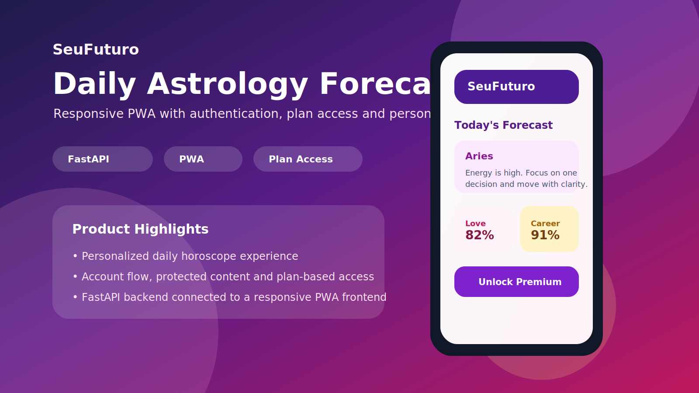

# SeuFuturo

SaaS de previsões astrológicas com backend FastAPI, frontend PWA responsivo, autenticação, paywall por plano e assinatura recorrente.

## Screenshots




## Estrutura

```text
SeuFuturo/
├── backend/
│   ├── main.py
│   ├── requirements.txt
│   └── test_main.py
├── frontend/
│   ├── index.html
│   ├── manifest.json
│   ├── service-worker.js
│   ├── privacy.html
│   └── terms.html
├── screenshot-1.svg
├── preview-2.svg
└── README.md
```

## Configuração Local

Backend:

```bash
cd backend
pip install -r requirements.txt
python main.py
```

Frontend:

```bash
python -m http.server 8001 --directory frontend
```

URLs locais:

- Frontend: `http://127.0.0.1:8001`
- Backend: `http://127.0.0.1:8000`
- Swagger: `http://127.0.0.1:8000/docs`

## Funcionalidades

- Frontend PWA responsivo
- Backend FastAPI
- Autenticação
- Controle de planos
- Fluxo de checkout
- Termos e política de privacidade
- Testes automatizados

## Planos

| Plano | Funcionalidades |
|---|---|
| Basic | Previsão diária |
| Premium | Amor + carreira |
| VIP | Tudo + sorte e conselho místico |

## Endpoints Principais

- `POST /api/auth/register`
- `POST /api/auth/login`
- `GET /api/me`
- `GET /api/horoscopo`
- `POST /api/checkout/session`
- `POST /api/billing/portal`

## Testes

```bash
pytest backend/test_main.py -q
```

## Status

Projeto preparado como MVP SaaS/PWA. Antes de tráfego real, recomenda-se trocar armazenamento local por banco externo, revisar segurança, configurar variáveis de produção e validar o fluxo completo de pagamento.
